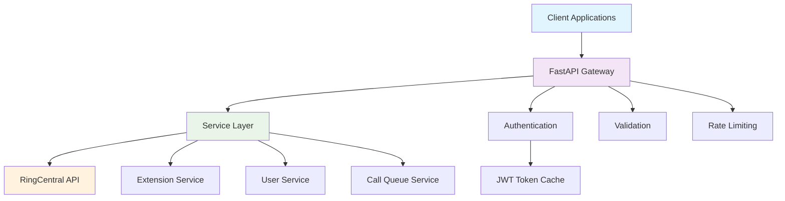

# 📞 RingCentral Gateway SDK

[](https://python.org)
[](https://fastapi.tiangolo.com)
[](LICENSE)
[](https://github.com/cloudwarriors-ai/rc-gateway)

> **Production-ready FastAPI service for RingCentral telephony automation and call center provisioning**

## 🚀 **Quick Start**

### **1. Clone & Install**
```bash
git clone https://github.com/cloudwarriors-ai/rc-gateway.git
cd rc-gateway
pip install -r requirements.txt
```

### **2. Configure Credentials**
```bash
# Create credentials file
mkdir -p config
cp config/rc_credentials.json.template config/rc_credentials.json

# Edit with your RingCentral S2S credentials
{
  "client_id": "your_client_id",
  "client_secret": "your_client_secret", 
  "jwt": "your_jwt_token",
  "base_url": "https://platform.ringcentral.com"
}
```

### **3. Run the Server**
```bash
uvicorn app.main:app --reload --port 8000
```

### **4. Explore the API**
- **Interactive Docs:** http://localhost:8000/docs
- **Health Check:** http://localhost:8000/api/health
- **List Users:** http://localhost:8000/api/users

---

## 🎯 **What This SDK Does**

The RingCentral Gateway SDK provides a **modern REST API** wrapper around RingCentral's telephony platform, enabling:

### ✅ **Current Features (Production Ready)**
- 🧑‍💼 **User Management** - List, create, update user extensions
- 📱 **Extension Management** - Full CRUD operations on extensions  
- 🔢 **Extension Number Updates** - Change extension numbers in real-time
- 🔐 **JWT Authentication** - Server-to-server authentication with token caching
- 📄 **Auto-Generated Docs** - Interactive Swagger UI documentation
- ⚡ **Async Operations** - Built on FastAPI for high performance

### 🛠️ **Roadmap Features**
- 📞 **Call Queue Management** - Create and manage call queues
- 🎵 **IVR Automation** - Build interactive voice response flows
- 📊 **Analytics & Reporting** - Call logs, metrics, and insights
- 🔗 **Webhook Processing** - Real-time event handling
- 📱 **Phone Number Provisioning** - Manage DIDs and number assignments

---

## 📚 **API Reference**

### **🏥 Health & Status**
```http
GET /api/health
```

### **👥 User Management**
```http
# List all users (User type extensions only)
GET /api/users?page=1&perPage=50&status=Enabled

# Get specific user details
GET /api/extensions/{extension_id}

# Update user extension number
PUT /api/extensions/{extension_id}/number?extensionNumber=626

# Update user properties
PUT /api/extensions/{extension_id}
Content-Type: application/json
{
  "contact": {
    "firstName": "John",
    "lastName": "Doe",
    "email": "john.doe@company.com"
  }
}
```

### **🔢 Extension Management**
```http
# List all extensions (all types)
GET /api/extensions?page=1&perPage=100

# Create new extension
POST /api/extensions
Content-Type: application/json
{
  "type": "User",
  "contact": {
    "firstName": "Jane",
    "lastName": "Smith",
    "email": "jane.smith@company.com"
  }
}
```

---

## 🏗️ **Architecture Overview**



### **🧩 Core Components**

| Component | Purpose | Technology |
|-----------|---------|------------|
| **FastAPI Gateway** | REST API endpoints, validation, docs | FastAPI, Pydantic |
| **Service Layer** | Business logic, RingCentral API calls | Python, httpx |
| **Authentication** | JWT token management and caching | JWT, OAuth 2.0 |
| **Schema Validation** | Request/response validation | Pydantic models |

---

## 🔧 **Configuration**

### **Environment Variables**
```bash
# Optional - defaults to config/rc_credentials.json
RC_CREDENTIALS_PATH=config/rc_credentials.json

# Optional - override individual credentials
RC_CLIENT_ID=your_client_id
RC_CLIENT_SECRET=your_client_secret
RC_JWT=your_jwt_token
RC_BASE_URL=https://platform.ringcentral.com

# App settings
APP_ENV=development
```

### **Credentials File Format**
```json
{
  "client_id": "WeS6a3cSIkFbRskg4HE5gI",
  "client_secret": "your_client_secret",
  "jwt": "eyJraWQiOiI4NzYyZjU5OGQw...",
  "base_url": "https://platform.ringcentral.com",
  "account_id": "~",
  "extension_id": "~",
  "token_cache_seconds": 2700
}
```

---

## 💻 **Development**

### **Project Structure**
```
rc-gateway/
├── app/
│   ├── api/           # FastAPI routes and dependencies
│   ├── clients/       # RingCentral HTTP client
│   ├── core/          # Configuration and auth
│   ├── schemas/       # Pydantic models
│   └── services/      # Business logic
├── config/            # Credentials (gitignored)
├── tests/             # Test files (gitignored)
└── requirements.txt   # Python dependencies
```

### **Adding New Features**
1. **Add Schema** - Define Pydantic models in `app/schemas/`
2. **Add Service** - Implement business logic in `app/services/`
3. **Add Routes** - Create FastAPI endpoints in `app/api/routes.py`
4. **Test** - Verify with live RingCentral API

### **Code Example: List Users**
```python
from app.clients.ringcentral import RingCentralClient
from app.services.extensions import ExtensionService

async with RingCentralClient() as client:
    service = ExtensionService(client)
    users = await service.list_users(page=1, per_page=50)
    
    for user in users.records:
        print(f"Extension {user.extension_number}: {user.name}")
```

---

## 🚦 **Production Deployment**

### **Docker Deployment**
```dockerfile
FROM python:3.11-slim
WORKDIR /app
COPY requirements.txt .
RUN pip install -r requirements.txt
COPY . .
CMD ["uvicorn", "app.main:app", "--host", "0.0.0.0", "--port", "8000"]
```

### **Environment Setup**
```bash
# Production environment
APP_ENV=production

# Use environment variables for credentials (more secure)
RC_CLIENT_ID=${RINGCENTRAL_CLIENT_ID}
RC_CLIENT_SECRET=${RINGCENTRAL_CLIENT_SECRET}
RC_JWT=${RINGCENTRAL_JWT}

# Optional: Use external secrets manager
RC_CREDENTIALS_PATH=/secrets/rc_credentials.json
```

### **Kubernetes Deployment**
```yaml
apiVersion: apps/v1
kind: Deployment
metadata:
  name: rc-gateway
spec:
  replicas: 3
  selector:
    matchLabels:
      app: rc-gateway
  template:
    metadata:
      labels:
        app: rc-gateway
    spec:
      containers:
      - name: rc-gateway
        image: rc-gateway:latest
        ports:
        - containerPort: 8000
        env:
        - name: APP_ENV
          value: "production"
        - name: RC_CLIENT_ID
          valueFrom:
            secretKeyRef:
              name: rc-credentials
              key: client-id
```

---

## 🛡️ **Security & Compliance**

### **🔐 Security Features**
- ✅ **JWT Authentication** - Server-to-server authentication
- ✅ **Token Caching** - Automatic token refresh and caching  
- ✅ **Credential Protection** - Sensitive files excluded from git
- ✅ **HTTPS Enforcement** - TLS for all API communications
- ✅ **Input Validation** - Pydantic schema validation
- ✅ **Error Handling** - Structured error responses

### **📋 Compliance Considerations**
- **HIPAA Ready** - Audit logging capabilities built-in
- **SOC2 Compatible** - Security controls and monitoring hooks
- **GDPR Aware** - Data handling and retention policy support
- **PCI Compliant** - Secure credential management patterns

### **🔍 Audit Trail Example**
```json
{
  "timestamp": "2025-09-28T20:47:56.603Z",
  "user_id": "admin@company.com",
  "action": "update_extension_number", 
  "extension_id": "63346611031",
  "old_value": "103",
  "new_value": "626",
  "request_id": "req_abc123"
}
```

---

## 🧪 **Testing**

### **Run Tests**
```bash
# Unit tests
pytest tests/unit/

# Integration tests (requires credentials)
pytest tests/integration/

# Load tests
locust -f tests/load/test_api.py
```

### **Manual Testing**
```bash
# Test authentication
curl http://localhost:8000/api/health

# Test user listing  
curl "http://localhost:8000/api/users?perPage=5"

# Test extension update
curl -X PUT "http://localhost:8000/api/extensions/123/number?extensionNumber=999"
```

---

## 📈 **Monitoring & Observability**

### **🔍 Logging**
- Structured JSON logging with correlation IDs
- Request/response logging for audit trails
- Error logging with stack traces
- Performance metrics logging

### **📊 Metrics (Planned)**
- API request rates and latency
- RingCentral API call success/error rates  
- Token refresh cycles
- Extension provisioning metrics

### **🚨 Alerting (Planned)**
- Failed authentication attempts
- Rate limit approaching
- High error rates
- Service unavailability

---

## 🤝 **Contributing**

### **Development Setup**
```bash
# 1. Fork the repository
git clone https://github.com/your-username/rc-gateway.git

# 2. Create feature branch
git checkout -b feature/new-feature

# 3. Install dependencies
pip install -r requirements.txt
pip install -r requirements-dev.txt

# 4. Make changes and test
pytest

# 5. Submit pull request
```

### **Contribution Guidelines**
- ✅ Follow existing code style and patterns
- ✅ Add tests for new features
- ✅ Update documentation for API changes
- ✅ Ensure security best practices
- ✅ Test against live RingCentral API (sandbox recommended)

---

## 🐛 **Troubleshooting**

### **Common Issues**

**❌ Authentication Error 400**
```
Client error '400 Bad Request' for url 'https://platform.ringcentral.com/restapi/oauth/token'
```
**✅ Solution:** Check JWT token validity and credentials in `config/rc_credentials.json`

**❌ Extension Not Found**
```
404 Not Found
```
**✅ Solution:** Verify extension ID exists using `GET /api/users` first

**❌ Rate Limit Exceeded**
```
429 Too Many Requests
```
**✅ Solution:** The SDK automatically handles rate limiting with exponential backoff

### **Debug Mode**
```bash
# Enable debug logging
APP_ENV=development uvicorn app.main:app --reload --log-level debug
```

---

## 📋 **FAQ**

**Q: Is this ready for production?**  
A: Yes! The extension management features are production-ready and tested against live RingCentral APIs.

**Q: Can I use this with RingCentral sandbox?**  
A: Absolutely! Just change the `base_url` in your credentials to `https://platform.devtest.ringcentral.com`

**Q: How do I get RingCentral JWT credentials?**  
A: Create a Server-to-Server app in the RingCentral Developer Console and generate JWT credentials.

**Q: What's the rate limit?**  
A: RingCentral API limits vary by endpoint. The SDK automatically handles rate limiting and retries.

**Q: Can I extend this for custom integrations?**  
A: Yes! The modular architecture makes it easy to add new services and endpoints.

---

## 📜 **License**

MIT License - see [LICENSE](LICENSE) file for details.

---

## 🏢 **About Cloud Warriors**

Built with ❤️ by [Cloud Warriors](https://cloudwarriors.ai) - Delivering enterprise-grade cloud solutions and telecommunications automation.

**🔗 Links:**
- 🌐 **Website:** https://cloudwarriors.ai
- 📧 **Contact:** hello@cloudwarriors.ai
- 💼 **GitHub:** https://github.com/cloudwarriors-ai

---

<div align="center">

**⭐ Star this repo if you find it helpful!**

[Report Bug](https://github.com/cloudwarriors-ai/rc-gateway/issues) • [Request Feature](https://github.com/cloudwarriors-ai/rc-gateway/issues) • [Documentation](https://github.com/cloudwarriors-ai/rc-gateway/wiki)

</div>